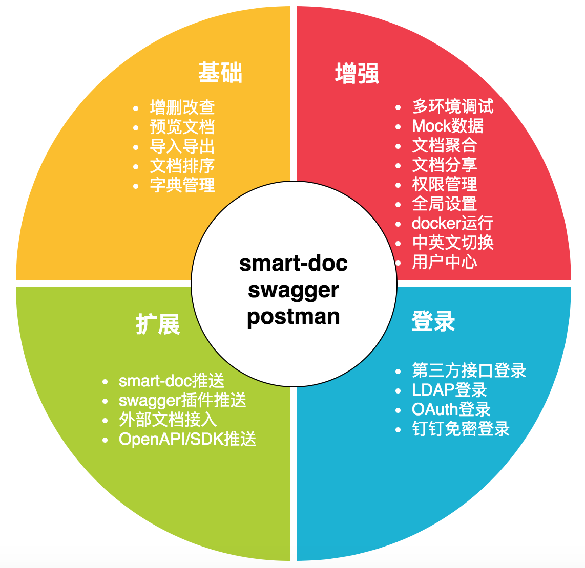
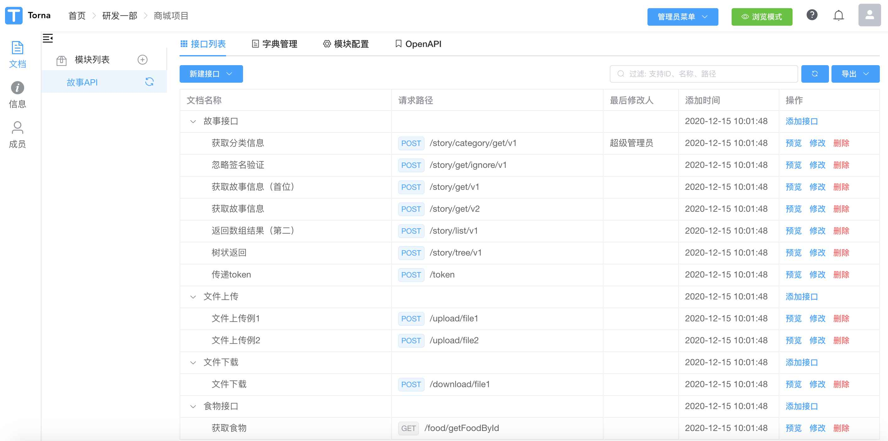
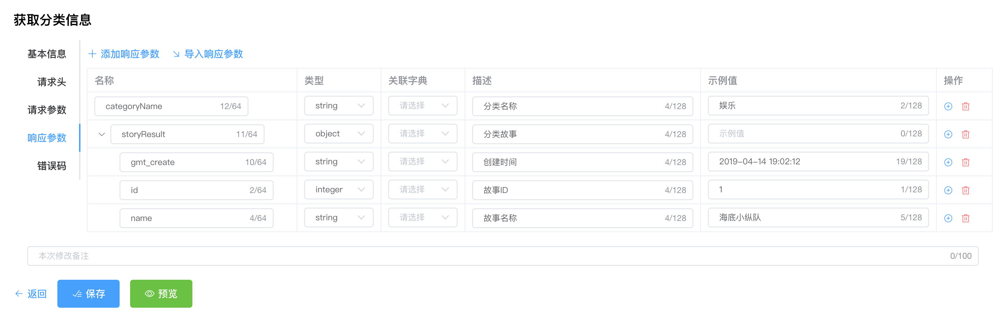
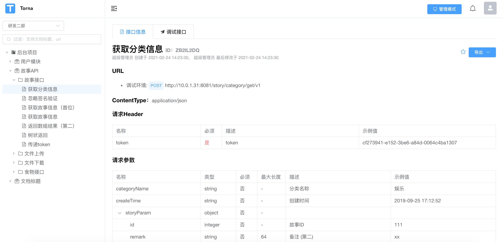
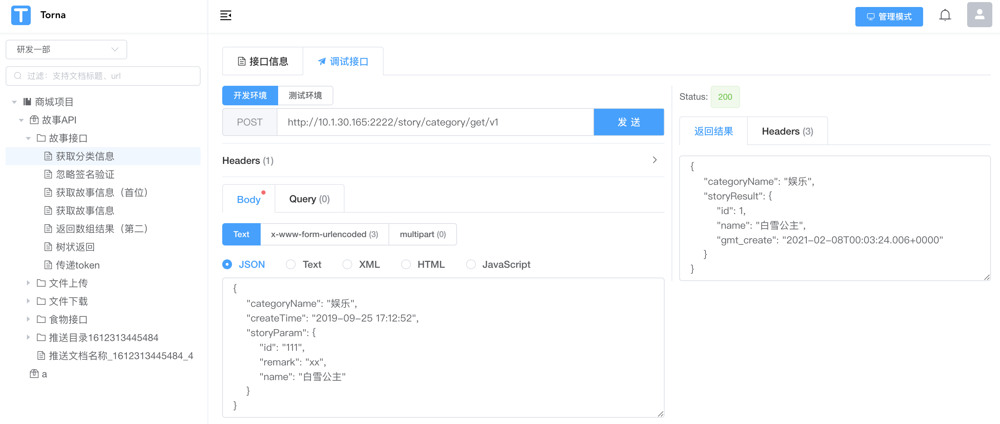

# Torna

[English](readme.md) | 简体中文

接口文档解决方案，目标是让接口文档管理变得更加方便、快捷。Torna采用团队协作的方式管理和维护接口文档，将不同形式的文档纳入进来统一维护。

Torna弥补了传统文档生成工具（如swagger）的不如之处，在保持原有功能的前提下丰富并增强了一些实用的功能。




## 解决文档管理痛点

- 不满足swagger文档预览页面和调试页面的展现方式
- 不喜欢swagger这种侵入式注解
- 希望使用javadoc注释生成文档，并进行接口调试
- 希望把公司所有项目接口文档进行统一管理
- 希望把项目中的若干文档提供给第三方调用者查看
- 希望可以统一管理项目中的字典枚举

如果您有以上几个需求和痛点，或许可以尝试一下使用Torna

## 使用步骤

### 方式1：下载zip本地运行

- 准备工作

  - Java环境，最低要求Java8
  - MySQL，要求5.6.5及以后，5.6.5之前的版本见：[支持低版本MySQL](http://torna.cn/dev/mysql-lower-version.html)

前往 [发行版页面](https://gitee.com/durcframework/torna/releases) ，下载最新版本，解压zip

导入数据库，执行[mysql.sql](./mysql.sql)

打开`application.properties`配置文件，修改数据库连接配置

执行`sh startup.sh`启动（Windows执行`startup.bat`）

访问：`http://ip:7700`

- 登录账号：

用户名：`admin`，密码：`123456`

- 后续升级

无特殊说明，只需要覆盖`torna.jar文件`和`dist文件夹`，然后重启即可


### 方式2：docker运行

导入数据库，执行[mysql.sql](./mysql.sql)

下载公共镜像

`docker pull tanghc2020/torna:1.18.1`

在`/etc/torna/`下创建一个空文件`application.properties`用来存放配置，执行命令：

`mkdir /etc/torna && touch /etc/torna/application.properties`

编辑配置文件

`vim /etc/torna/application.properties`

输入如下配置：

```properties
# 服务器端口
server.port=7700

# MySQL地址
mysql.host=<mysql_ip>:3306
# 数据库名称
mysql.schema=torna
# 数据库账号，确保能执行DDL语句
mysql.username=<username>
mysql.password=<password>
```

修改对应的MySQL地址、账号

执行docker命令：

```
docker run --name torna --restart=always \
  -p 7700:7700 \
  -e JAVA_OPTS="-server -Xms512m -Xmx512m" \
  -v /etc/torna/application.properties:/torna/config/application.properties \
  -d tanghc2020/torna:1.18.1
```

浏览器访问`http://ip:7700`，ip对应docker宿主机器ip，非docker容器ip

[运维脚本](http://torna.cn/dev/common-script.html#docker%E9%87%8D%E5%90%AFtorna%E8%84%9A%E6%9C%AC)

### docker-compose部署torna
[【docker-compose方式部署torna】](https://gitee.com/durcframework/torna/tree/master/torna-docker-compose)

### kubernetes部署torna
[【kubernetes部署torna】](https://gitee.com/durcframework/torna/tree/master/torna-on-kubernetes)

## 推荐组合

**smart-doc + Torna实现文档全流程自动化**

如果您使用Java语言，推荐使用`smart-doc + Torna`

[Torna整合smart-doc教程](http://torna.cn/dev/smart-doc.html)

[smart-doc](https://gitee.com/smart-doc-team/smart-doc) + Torna 组成行业领先的文档生成和管理解决方案，使用smart-doc无侵入完成Java源代码和注释提取生成API文档，自动将文档推送到Torna企业级接口文档管理平台。

通过这套组合您可以实现：只需要写完Java注释就能把接口信息推送到Torna平台，从而实现接口预览、接口调试。

如果您是非Java语言，可以使用表单页面编辑以上内容，完成后同样可以进行接口预览、调试。

## 其它资源

- [开发文档](http://torna.cn/dev/)
- [Torna整合smart-doc教程](http://torna.cn/dev/smart-doc.html)
- [Torna对应的示例工程](https://gitee.com/durcframework/torna-example) ，演示swagger插件的用法
- [Torna整合smart-doc示例](https://gitee.com/durcframework/torna-and-smart-doc)

## 更新日志

[changelog](./changelog.md)

## 参与贡献

欢迎贡献代码，PR请提交到`develop`分支


## 界面预览










## 沟通交流

<table>
  <tr>
    <td>一群(满)</td>
    <td>二群</td>
  </tr>
  <tr>
    <td></td>
    <td></td>
  </tr>
</table>


