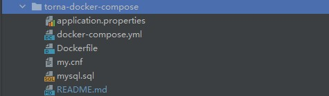

> 使用docker-compose部署torna。
>
> 操作系统为CentOS7。

# 环境要求
- docker 18+
- docker-compose 1.12+
- mysql 5.7+


# 准备

初始化数据库，此配置默认创建了一个mysql容器，并且会自动执行mysql脚本文件。如果需要使用已有的mysql，请自行更改相关配置，然后手动导入sql脚本。


# Docker的安装

* 软件包更新到最新：

```shell
yum -y update
```

* 关闭selinux：

```shell
# 查看selinux是否开启
getenforce
```

```shell
# 永久关闭selinux，需要重启
sed -i 's/enforcing/disabled/' /etc/selinux/config
```

```shell
# 临时关闭selinux，重启之后，无效
setenforce 0
```

* 关闭swap分区：

```shell
# 永久关闭swap分区，需要重启
sed -ri 's/.*swap.*/#&/' /etc/fstab
```

```shell
# 临时关闭swap分区，重启之后，无效
swapoff -a
```

* 重启机器：

```shell
reboot
```

* 安装Docker：

```shell
wget https://mirrors.aliyun.com/docker-ce/linux/centos/docker-ce.repo -O /etc/yum.repos.d/docker-ce.repo
```

```shell
yum -y install docker-ce
```

```shell
systemctl enable docker && systemctl start docker
```

```shell
docker version
```

* 设置Docker的镜像加速器：

```shell
sudo mkdir -p /etc/docker
```

```shell
sudo tee /etc/docker/daemon.json <<-'EOF'
{
  "exec-opts": ["native.cgroupdriver=systemd"],	
  "registry-mirrors": ["https://b9pmyelo.mirror.aliyuncs.com"],	
  "live-restore": true,
  "log-driver":"json-file",
  "log-opts": {"max-size":"500m", "max-file":"3"}
}
EOF
```

```shell
sudo systemctl daemon-reload
```

```shell
sudo systemctl restart docker
```


# docker-compose安装

* 命令行curl工具在线安装：

```
# Compose目前已经完全支持Linux、Mac OS和Windows，在我们安装Compose之前，需要先安装Docker。下面我们以编译好的二进制包方式安装在Linux系统中。 
curl -L https://github.com/docker/compose/releases/download/1.26.2/docker-compose-`uname -s`-`uname -m` -o /usr/local/bin/docker-compose
```
* 在国内，GitHub访问可能很慢，请到下面的地址中去下载。

```
https://github.com/docker/compose/releases
```
* 下载后重名为docker-compose。如果你在windows上下载也可以重命名后传到linux服务器上。
* 当然，也可以使用国内的地址在线安装。

```shell
curl -L https://get.daocloud.io/docker/compose/releases/download/1.26.2/docker-compose-`uname -s`-`uname -m` > /usr/local/bin/docker-compose
```

* 将docker-compose放到`/usr/local/bin/`目录下。然后执行下列命令完成安装。

```
sudo chmod +x /usr/local/bin/docker-compose
```
* 创建软链接

```shell
sudo ln -s /usr/local/bin/docker-compose /usr/bin/docker-compose
```

* 安装完成后可以执行下面命令检查

```
docker-compose --version
```


# docker-compose的卸载

* 卸载命令：

```shell
rm /usr/local/bin/docker-compose
```


# 部署torna

> 在部署torna的服务器上创建一个torna的目录用于放置部署配置。

## 创建docker-compose.yaml编排文件



* mysql.sql：略。

* Dockerfile（之所以有这个Dockerfile文件，是为了启动mysql容器的时候，执行mysql脚本）：

```dockerfile
FROM mysql:5.7
#定义会被容器自动执行的目录
ENV AUTO_RUN_DIR /docker-entrypoint-initdb.d
#定义初始化sql文件
ENV INIT_SQL mysql.sql
#把要执行的sql文件放到/docker-entrypoint-initdb.d/目录下，容器会自动执行这个sql
COPY $INIT_SQL $AUTO_RUN_DIR
#给执行文件增加可执行权限
RUN chmod a+x $AUTO_RUN_DIR/$INIT_SQL
```

* docker-compose.yaml内容参考如下：

```dockerfile
version: "3"
services:
  mysql:
    build:
      context: ./
      dockerfile: Dockerfile
    container_name: mysql
#    ports:
#      - 3306:3306
    environment:
      TZ: Asia/Shanghai
      MYSQL_ROOT_PASSWORD: 123456
      MYSQL_ROOT_HOST: '%'
    command:
      --default-authentication-plugin=mysql_native_password
      --character-set-server=utf8mb4
      --collation-server=utf8mb4_general_ci
      --lower_case_table_names=1
    volumes:
      - ./my.cnf:/etc/my.cnf
    networks:
      - torna-net
    restart: always
  torna:
    image: tanghc2020/torna:latest
    container_name: torna
    ports:
      - 7700:7700
    depends_on:
      - mysql
    ## 建立连接
    links:
      - mysql
    volumes:
      - ./application.properties:/torna/config/application.properties
    environment:
      - TZ=Asia/Shanghai
      - JAVA_OPTS=-server -Xmx512m -Xms512m -Djava.awt.headless=true
    networks:
      - torna-net
    restart: always
networks:
  torna-net:
```
* volumes中的配置表示把本地的配置挂载到torna容器中。可以挂载多个文件。
* 上面配置中暴露的端口是7700。

## 创建application.properties
* application.properties源自`server/boot/src/main/resources/application.properties`,因此实际使用过程中请参考最新的配置来更新，下面主要是做说明和参考：

```
# 服务端口
server.port=7700

# 数据库连接配置
# mysql.host=localhost:3306
mysql.host=mysql:3306
mysql.username=root
mysql.password=123456
```
* 主要是修改application.properties中的数据库配置为自己的数据库（注意：这里的mysql的host我写的是mysql，是因为docker-compose.yaml中的torna和mysql服务建立了连接，名称为mysql）。

* 当然如果你的服务器可以连接外部网络，那么上面的过程你完全可以直接如命令下载到服务器：

```shell
mkdir /data/torna-docker-compose
```

```shell
cd /data/torna-docker-compose
```

```shell
wget https://gitee.com/durcframework/torna/raw/master/server/boot/src/main/resources/application.properties
```

```shell
wget https://gitee.com/durcframework/torna/raw/master/torna-docker-compose/docker-compose.yml
```

* 下载完后修改application.properties配置即可.

## 启动和停止容器
* 完成上面的配置后，就可以启动torna。

* 启动

```
docker-compose up -d
```
* 停止

```
docker-compose down
```
**注意：** 执行启动或者是停止命令都需要进入到torna部署目录，
即必须是在docker-compose.yaml所在目录下执行。

## 登陆torna
http://ip:7700/
>登录账号相关信息直接查看项目的顶层readme文档。
## 查看日志
* 如果你需要观察sql语句在torna中的执行情况。通过docker logs来查看。

```
# 查询出torna容器的id
docker ps|grep torna
# 根据容器id查看日志
docker logs -f [容器id]
```

